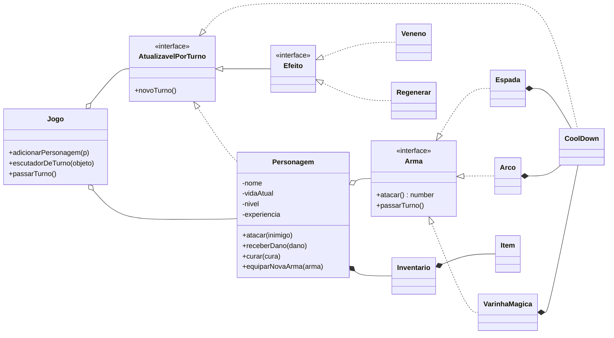

# Programação Orientada a Objetos

Projetos da disciplina de Programação Orientada a Objetos — Ciência da Computação, UNIFESP.

## Sistema de combate de RPG

Combate por turnos em **TypeScript**: personagens atacam com armas diferentes, sofrem efeitos
que duram vários turnos (veneno, regeneração) e sobem de nível ao derrotar inimigos.

O foco está na modelagem: tudo o que muda a cada turno implementa a mesma interface,
`AtualizavelPorTurno`, e o `Jogo` só precisa avisar essa lista quando o turno passa — sem
saber se está falando com um personagem, um cooldown ou um veneno.



### Conceitos aplicados

| Conceito | Onde aparece |
| --- | --- |
| **Interfaces** | `Arma`, `Efeito` e `AtualizavelPorTurno` definem contratos; o código depende deles, não das classes concretas |
| **Polimorfismo** | `Personagem.atacar()` chama `arma.atacar()` sem saber se é espada, arco ou varinha |
| **Composição** | cada arma tem o próprio `CoolDown`; cada personagem tem um `Inventario` de `Item`s |
| **Encapsulamento** | vida, nível e experiência são privados; só mudam por `receberDano`, `curar` e `ganharExp` |
| **Observador** | o `Jogo` guarda quem quer ser avisado (`escutadorDeTurno`) e dispara `novoTurno()` em todos |

Cada arma tem uma regra própria: a **espada** entra em recarga depois de um golpe, o **arco**
gasta flechas e precisa ser recarregado, e a **varinha** consome mana.

### Como rodar

Requer [Node.js](https://nodejs.org) 20 ou mais recente.

```bash
cd SistemaCombateRPG
npm install
npm run build
npm start
```

`npm run build` compila o TypeScript para `dist/`, e `npm start` roda a partida de exemplo
de [`main.ts`](SistemaCombateRPG/main.ts). Trecho da saída:

```text
Goblin sofreu 45 de dano
Espada em tempo de CoolDown
Goblin sofreu 0 de dano
Mana insuficiente
Sem flechas disponiveis
5 Flechas recarregadas
250 manas foram adicionadas
Felipe sofreu 20 de dano
Cura de:50 realizada pelo Efeito Regenerar
Goblin foi derrotado
Felipe recebeu 100 de experiencia
Felipe subiu de nivel! - Novo nivel: 2
```

### Estrutura

```text
SistemaCombateRPG/
  main.ts                  partida de exemplo
  Jogo.ts                  controla os turnos
  Personagem.ts            vida, nível, arma e inventário
  Arma.ts                  interface das armas
  Espada.ts Arco.ts Varinha.ts
  Efeito.ts                interface dos efeitos
  Veneno.ts Regenerar.ts
  AtualizavelPorTurno.ts   interface de tudo que reage à passagem de turno
  CoolDown.ts              recarga usada pelas armas
  Inventario.ts Item.ts
```
