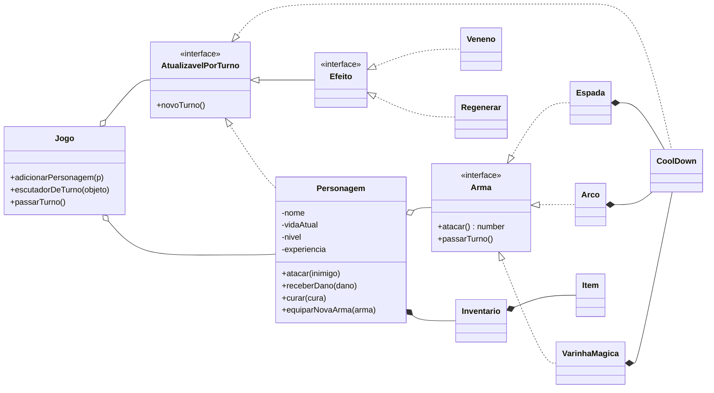
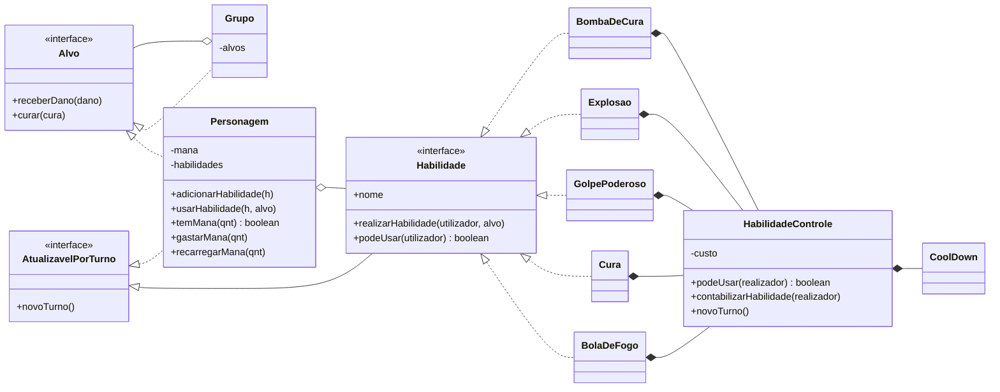

# Programação Orientada a Objetos

Projetos da disciplina de Programação Orientada a Objetos — Ciência da Computação, UNIFESP.

## Sistema de combate de RPG

O projeto foi feito em duas etapas, cada uma em sua própria pasta:

| Pasta | Conteúdo |
| --- | --- |
| [`SistemaCombateRPG/`](SistemaCombateRPG) | **Parte 1**: jogo, personagens, armas, cooldown, inventário e efeitos |
| [`SistemaCombateRPG-Parte2/`](SistemaCombateRPG-Parte2) | **Parte 2**: habilidades especiais, mana no personagem e ataques em área |

## Parte 1: combate por turnos

Combate por turnos em **TypeScript**: personagens atacam com armas diferentes, sofrem efeitos
que duram vários turnos (veneno, regeneração) e sobem de nível ao derrotar inimigos.

O foco está na modelagem: tudo o que muda a cada turno implementa a mesma interface,
`AtualizavelPorTurno`, e o `Jogo` só precisa avisar essa lista quando o turno passa — sem
saber se está falando com um personagem, um cooldown ou um veneno.



### Conceitos aplicados (Parte 1)

| Conceito | Onde aparece |
| --- | --- |
| **Interfaces** | `Arma`, `Efeito` e `AtualizavelPorTurno` definem contratos; o código depende deles, não das classes concretas |
| **Polimorfismo** | `Personagem.atacar()` chama `arma.atacar()` sem saber se é espada, arco ou varinha |
| **Composição** | cada arma tem o próprio `CoolDown`; cada personagem tem um `Inventario` de `Item`s |
| **Encapsulamento** | vida, nível e experiência são privados; só mudam por `receberDano`, `curar` e `ganharExp` |
| **Observador** | o `Jogo` guarda quem quer ser avisado (`escutadorDeTurno`) e dispara `novoTurno()` em todos |

Cada arma tem uma regra própria: a **espada** entra em recarga depois de um golpe, o **arco**
gasta flechas e precisa ser recarregado, e a **varinha** consome mana.

### Como rodar

Requer [Node.js](https://nodejs.org) 20 ou mais recente.

```bash
cd SistemaCombateRPG
npm install
npm run build
npm start
```

`npm run build` compila o TypeScript para `dist/`, e `npm start` roda a partida de exemplo
de [`main.ts`](SistemaCombateRPG/main.ts). Trecho da saída:

```text
Goblin sofreu 45 de dano
Espada em tempo de CoolDown
Goblin sofreu 0 de dano
Mana insuficiente
Sem flechas disponiveis
5 Flechas recarregadas
250 manas foram adicionadas
Felipe sofreu 20 de dano
Cura de:50 realizada pelo Efeito Regenerar
Goblin foi derrotado
Felipe recebeu 100 de experiencia
Felipe subiu de nivel! - Novo nivel: 2
```

### Estrutura

```text
SistemaCombateRPG/
  main.ts                  partida de exemplo
  Jogo.ts                  controla os turnos
  Personagem.ts            vida, nível, arma e inventário
  Arma.ts                  interface das armas
  Espada.ts Arco.ts Varinha.ts
  Efeito.ts                interface dos efeitos
  Veneno.ts Regenerar.ts
  AtualizavelPorTurno.ts   interface de tudo que reage à passagem de turno
  CoolDown.ts              recarga usada pelas armas
  Inventario.ts Item.ts
```

## Parte 2: habilidades especiais

Os personagens agora têm **mana** e podem aprender **habilidades especiais**. A extensão foi
feita sem mudar o `Jogo`: ele continua só avisando que o turno passou, e cada personagem
repassa o aviso para a arma e para as próprias habilidades.

| Habilidade | Efeito | Mana | Cooldown |
| --- | --- | --- | --- |
| Bola de Fogo | 40 de dano | 20 | 2 turnos |
| Cura | recupera 30 de vida | 15 | 1 turno |
| Golpe Poderoso | 60 de dano | 0 | 3 turnos |
| Explosão | 20 de dano em todos os inimigos | 25 | 3 turnos |
| Bomba de Cura *(autoral)* | recupera 15 de vida de todo o grupo | 35 | 4 turnos |



### Conceitos aplicados (Parte 2)

| Conceito | Onde aparece |
| --- | --- |
| **Abstração** | `Habilidade` define o contrato de toda habilidade; `Alvo` define o que pode receber dano ou cura |
| **Composição** | cada habilidade compõe um `HabilidadeControle`, que compõe um `CoolDown`; a regra de mana e recarga existe em um único lugar |
| **Polimorfismo** | `Personagem.usarHabilidade()` chama `realizarHabilidade()` sem `if`, `switch` ou `instanceof` para saber qual habilidade é |
| **Delegação** | `Jogo → Personagem → Habilidade → HabilidadeControle → CoolDown`: cada um só repassa o turno para o próximo |
| **Composite** | `Grupo` também é um `Alvo` e repassa dano ou cura para cada membro; por isso a Explosão acerta vários inimigos sem nenhuma condição especial |
| **Encapsulamento** | a mana é privada e só muda por `gastarMana` e `recarregarMana`; o cooldown fica escondido dentro do controle |

### Como rodar

```bash
cd SistemaCombateRPG-Parte2
npm install
npm run build
npm start
```

`npm start` roda a partida de exemplo de [`main2.ts`](SistemaCombateRPG-Parte2/main2.ts). Saída:

```text
Goblin sofreu 40 de dano
Habilidade em tempo de CoolDown
Goblin sofreu 40 de dano
Goblin sofreu 60 de dano
Goblin sofreu 20 de dano
Golem sofreu 20 de dano
Flor recebeu 30 de cura - Vida atual: 30
Felipe sofreu 45 de dano
Felipe recebeu 15 de cura - Vida atual: 70
Flor recebeu 15 de cura - Vida atual: 30
Otavio recebeu 15 de cura - Vida atual: 100
Sem mana suficiente
Flor nao possui Bola de Fogo
```

### Estrutura (arquivos novos ou alterados)

```text
SistemaCombateRPG-Parte2/
  main2.ts                 partida de exemplo com habilidades
  Habilidade.ts            interface das habilidades
  HabilidadeControle.ts    custo de mana + cooldown, compartilhado pelas habilidades
  BolaDeFogo.ts Cura.ts GolpePoderoso.ts Explosao.ts BombaDeCura.ts
  Alvo.ts                  interface de quem recebe dano ou cura
  Grupo.ts                 vários alvos tratados como um só
  Personagem.ts            agora com mana e lista de habilidades
  Arma.ts Varinha.ts       a varinha passa a gastar a mana do personagem
  CoolDown.ts              conta o turno atual na recarga
```
